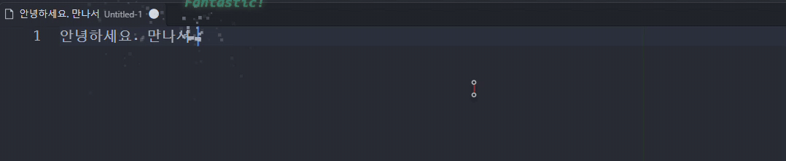

# Atom Power Mode (Canvas)

Brings Atom's [activate-power-mode](https://github.com/JoelBesada/activate-power-mode) to VS Code.

**Install:** [VS Code Marketplace — Atom Power Mode (Canvas)](https://marketplace.visualstudio.com/items?itemName=pks424.atom-power-mode)
or search `Atom Power Mode` in the Extensions view (`ext install pks424.atom-power-mode`).

Unlike decoration/GIF based power-mode extensions, this one draws on a **real canvas inside the workbench**:

- **Physics particles** burst from the cursor on every keystroke, colored with the **syntax color of the token you just typed**
- **Screen shake** while typing
- **Atom-style combo counter** with exclamations (Super!, Radical! ...)

> **⚠ How it works — please read before installing.**
> VS Code extensions cannot draw over the editor, so this extension adds one `<script>` line to VS Code's own `workbench.html`
> and updates the matching checksum in `product.json` so VS Code does not show the *"installation appears to be corrupt"* warning.
>
> - Changes are reverted by **Atom Power Mode: Disable**, and automatically when you **uninstall** the extension (on the next VS Code restart).
> - A VS Code update replaces both files; the extension re-applies itself on the next start and asks you to reload.
> - If VS Code is installed system-wide (e.g. `C:\Program Files`), run VS Code as administrator once and then run **Atom Power Mode: Re-apply Injection**.

## Commands

| Command | Description |
|---|---|
| `Atom Power Mode: Enable` | Enable and inject |
| `Atom Power Mode: Disable` | Disable and remove the injection |
| `Atom Power Mode: Re-apply Injection` | Force re-injection (e.g. after a VS Code update) |

## Settings (`atomPowerMode.*`)

| Setting | Default | Description |
|---|---|---|
| `enabled` | `true` | Power Mode on/off |
| `particleCount` | `12` | Particles per keystroke (±50% random) |
| `particleSize` | `3.5` | Particle size (px) |
| `gravity` | `0.12` | Gravity |
| `maxParticles` | `500` | Max particles alive at once |
| `shake.enabled` | `true` | Screen shake on/off |
| `shake.intensity` | `3` | Shake intensity (px) |
| `shake.duration` | `90` | Shake duration (ms) |
| `combo.enabled` | `true` | Show the combo counter |
| `combo.timeout` | `10` | Seconds until the combo resets (0 = never) |
| `combo.activationThreshold` | `0` | Only show effects at or above this combo |
| `combo.exclamations` | `true` | Show an exclamation every 10 combos |

Changing a setting re-injects automatically and asks you to reload the window.

## Credits

Inspired by [activate-power-mode](https://github.com/JoelBesada/activate-power-mode) by Joel Besada.

---

## 한국어

Atom 에디터의 activate-power-mode를 VS Code로 옮긴 확장입니다. 워크벤치에 캔버스를 직접 띄워 **신택스 색상 물리 파티클 + 화면 흔들림 + 콤보 카운터**를 보여줍니다.

**설치**: [VS Code 마켓플레이스](https://marketplace.visualstudio.com/items?itemName=pks424.atom-power-mode) 또는 확장 탭에서 `Atom Power Mode` 검색

**동작 방식(설치 전 확인)**: VS Code 확장은 에디터 위에 그림을 그릴 수 없어서, VS Code 설치 폴더의 `workbench.html`에 스크립트 한 줄을 추가하고 `product.json`의 해당 체크섬을 맞춰 *"설치가 손상된 것 같습니다"* 경고가 뜨지 않게 합니다.

- **Atom Power Mode: 비활성화** 명령이나 **확장 삭제**(다음 VS Code 재시작 시) 때 원래대로 되돌립니다.
- VS Code 업데이트 후에는 다음 시작 때 자동으로 다시 적용하고 리로드를 안내합니다.
- 시스템 전체 설치본(`C:\Program Files` 등)은 VS Code를 관리자 권한으로 한 번 실행한 뒤 **Atom Power Mode: 다시 주입**을 실행하세요.

설정은 VS Code 설정 화면에서 `Atom Power Mode`로 검색하면 한국어 설명과 함께 볼 수 있습니다.
